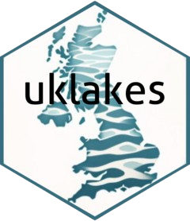

<!-- README.md is generated from README.Rmd. Please edit that file -->

```{r, include = FALSE}
knitr::opts_chunk$set(
  collapse = TRUE,
  comment = "#>",
  fig.path = "man/figures/README-",
  out.width = "100%"
)
```

# uklakes 

<!-- badges: start -->
[](https://github.com/robbriers/uklakes/actions/workflows/R-CMD-check.yaml)
[](https://app.codecov.io/gh/robbriers/uklakes)
[](https://lifecycle.r-lib.org/articles/stages.html#stable)
[](https://www.repostatus.org/#active)

<!-- badges: end -->

The [UK CEH Lake Portal](https://uklakes.ceh.ac.uk/) is a GIS-based inventory of information about more than 40000 lakes across the UK. The information available for each lake varies, but includes basic physical description, typology and other information. The `uklakes` package allows you to retrieve a summary of the lake information for a lake or series of lakes, based on the lake wbid (waterbody id) number. It does this by responsibly webscraping the information (using the [polite package](https://cran.r-project.org/package=polite)) from the webpage of each lake.

You can also search for lake wbid values based on strings in the lake name to determine the wbids to search for.

Information on the general physical characteristics, typology, chemistry and connectivity metrics are retrieved. Biology, Land cover and water quality information are not. For details of the information available, see the [UK Lakes Portal Website](https://uklakes.ceh.ac.uk/).

Use of the package implies acceptance of the Terms of Use available [here](https://www.ceh.ac.uk/terms-of-use).

## Installation

You can install the current version of uklakes from [GitHub](https://github.com/) with:

``` r
# install.packages("pak")
pak::pak("robbriers/uklakes")
```

## Details of use

There are two functions in the package.

The `search_lakes` function allows you to search for the lake wbid numbers for lakes matching (partial or full matches, case sensitive) a string provided.

```{r search examples, eval = FALSE}
library(uklakes)
search_lakes("Tarn")
# 140 Tarns in the portal database

search_lakes("Leven")
# two Loch Levens and one Loch of Levenwick
```

The second function (`get_lake_info`) retrieves the available information for the lake or lakes specified (wbid numbers). You can retrieve a single lake (a single wbid value), a series (wbid numbers separated by commas), a sequence of wbids (specified in the normal R sequence manner, i.e. 45:48), a vector of wbids (either as a standalone vector or a column of a df e.g. the wbid column from the output of search_lakes or a combination of these. See examples below.

```{r get info examples, eval = FALSE}
# Loch Lomond
get_lake_info(24447)

# some small lakes in Shetland
get_lake_info(4, 6, 9)

# a series of small lakes in Shetland
get_lake_info(1232:1238)

# the first 5 Tarns in the database
tarns <- search_lakes("Tarn")
get_lake_info(tarns$wbid[1:5])
```

The information is obtained by responsibly webscraping the lake information webpages. The package respects the rate limit and repeat request values specified by the robots.txt file of the UK CEH Lakes Portal pages (currently 1 request per 5 seconds and maximum of 3 attempts) and reports progress through the console. Any lakes that it fails to retrieve (either through incorrect wbids or other reasons) are reported at the end of the process.

The resultant output will have a different number of columns depending on what information is available for the lakes specified, giving NA values for those columns where the data is absent.
